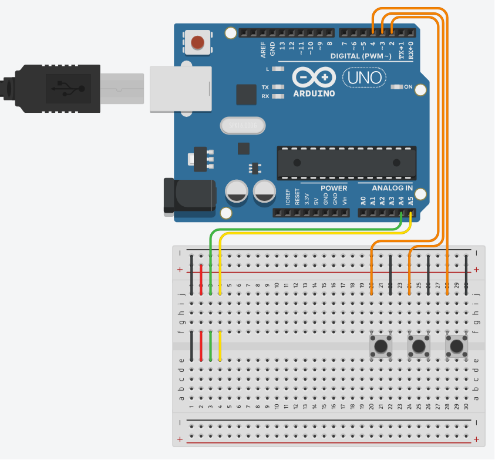
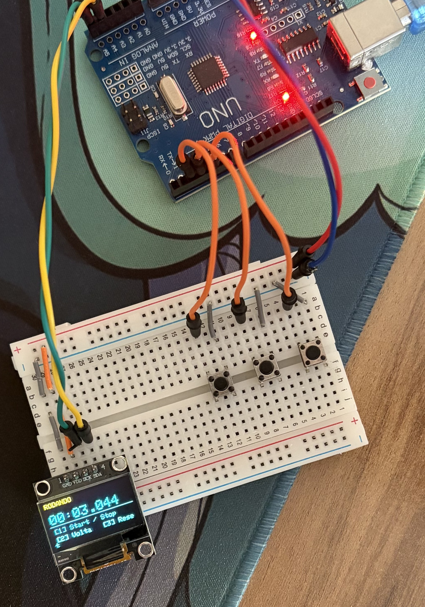

<div align="center">

# ⏱ Cronômetro com Voltas

**Meça tempos de volta com precisão de milissegundos — start, stop, lap e reset com feedback sonoro e visual.**

[](https://www.arduino.cc/)
[](https://isocpp.org/)
[](https://choosealicense.com/licenses/mit/)

</div>

---

## 📋 Descrição

O **Cronômetro com Voltas** é um cronômetro completo construído com Arduino UNO, display OLED bicolor e 3 botões. Mede tempo com `millis()`, suporta pause/resume e registra até 5 voltas com o split time individual de cada uma exibido na tela.

O display OLED bicolor é explorado intencionalmente: o header de status (RODANDO / PARADO / PRONTO) aparece na **zona amarela** (y=0–15) e o timer com o histórico de voltas na **zona azul** (y=16–63) — separação de cor por posicionamento de conteúdo, sem chamada de API de cor.

---

## ⚙️ Componentes Utilizados

| Quantidade | Componente | Especificação |
|:---:|---|---|
| 1x | Arduino Uno (ou compatível) | Microcontrolador ATmega328P |
| 1x | Display OLED bicolor | SSD1306 128×64 I2C — amarelo/azul |
| 3x | Botão (push button) | Pinos D2, D3, D4 |
| 1x | Buzzer passivo | Pino D8 |
| — | Jumper wires | Macho-macho |
| 1x | Protoboard | — |

---

## 🔌 Pinagem

```
Arduino Uno
├── D2   → Botão 1: Start / Stop  (INPUT_PULLUP)
├── D3   → Botão 2: Volta (Lap)   (INPUT_PULLUP)
├── D4   → Botão 3: Reset         (INPUT_PULLUP)
├── D8   → Buzzer passivo
├── A4   → OLED SDA
└── A5   → OLED SCL
```

---

## 🖼️ Esquemático




---

## 📦 Bibliotecas Necessárias

Instale pelo **Arduino IDE → Tools → Manage Libraries**:

| Biblioteca | Versão testada |
|---|---|
| Adafruit SSD1306 | 2.5.15 |
| Adafruit GFX Library | — |

---

## 💻 Como Funciona

### Controles

| Botão | Estado atual | Ação |
|---|---|---|
| BTN1 | PRONTO | Inicia o cronômetro |
| BTN1 | RODANDO | Pausa |
| BTN1 | PARADO | Retoma |
| BTN2 | RODANDO | Registra volta (split time) |
| BTN3 | PARADO / PRONTO | Reseta tudo |

> BTN3 é ignorado enquanto `RODANDO` — sem risco de reset acidental.

### Layout OLED (128×64 bicolor)

```
┌────────────────────────────────┐
│ RODANDO           LAP:3        │  y= 0  Status ── AMARELO (hardware)
├ ─ ─ ─ ─ ─ ─ ─ ─ ─ ─ ─ ─ ─ ─ ┤  y=16  ── fronteira física ──
│ 00:12.345                      │  y=16  Tempo total (font 2) ── AZUL
├────────────────────────────────┤  y=33  separador
│ V1  00:04.234                  │  y=36  Split das últimas 3 voltas
│ V2  00:05.111                  │  y=46
│ V3  00:03.000                  │  y=56
└────────────────────────────────┘
```

### Máquina de Estados

```
PRONTO ──BTN1──► RODANDO ──BTN1──► PARADO ──BTN1──► RODANDO
                    │                  │
                  BTN2              BTN3
                 (Lap)             (Reset)
                    │                  │
              registra split      volta a PRONTO
```

### Destaques Técnicos

- **`millis()`** com `tempoBase` + `tempoAcum` — pause/resume sem perda de precisão
- **Edge detection** nos 3 botões via struct `Botao` com flag `ready` — sem duplo disparo
- **`splitTime(i)`** calcula tempo individual de cada volta a partir dos acumulados
- **Cap de 20 FPS** no refresh do display (`DISPLAY_RATE = 50ms`) — sem flickering
- **Buzzer** com frequências distintas: start (1kHz), lap (2kHz), stop (duplo 700Hz), reset (400Hz)
- Sem `delay()` bloqueante no `loop()` — exceto durante o beep de stop (150ms, inofensivo pois o timer já foi pausado)

---

## 🗂️ Estrutura dos Arquivos

```
CronometroComVoltas/
├── README.md                                        # Esta documentação
├── post_linkedin.txt                                # Post para LinkedIn
├── sketch_cronometro_voltas/
│   └── sketch_cronometro_voltas.ino                # Código completo do projeto
└── circuit_images/
    └── .gitkeep                                    # Substituir pela foto do circuito
```

---

## 🚀 Como Usar

1. **Monte o circuito** conforme a pinagem acima.
2. **Instale as bibliotecas** Adafruit SSD1306 e Adafruit GFX.
3. **Abra o sketch:** `sketch_cronometro_voltas/sketch_cronometro_voltas.ino` no Arduino IDE.
4. **Selecione a placa:** `Tools → Board → Arduino Uno`.
5. **Selecione a porta:** `Tools → Port → COMx`.
6. **Faça upload:** `Ctrl+U`.
7. **Pressione BTN1** para iniciar, **BTN2** para marcar voltas, **BTN1** para pausar e **BTN3** para resetar.

---

*Desenvolvido por Felipe Grolla*

